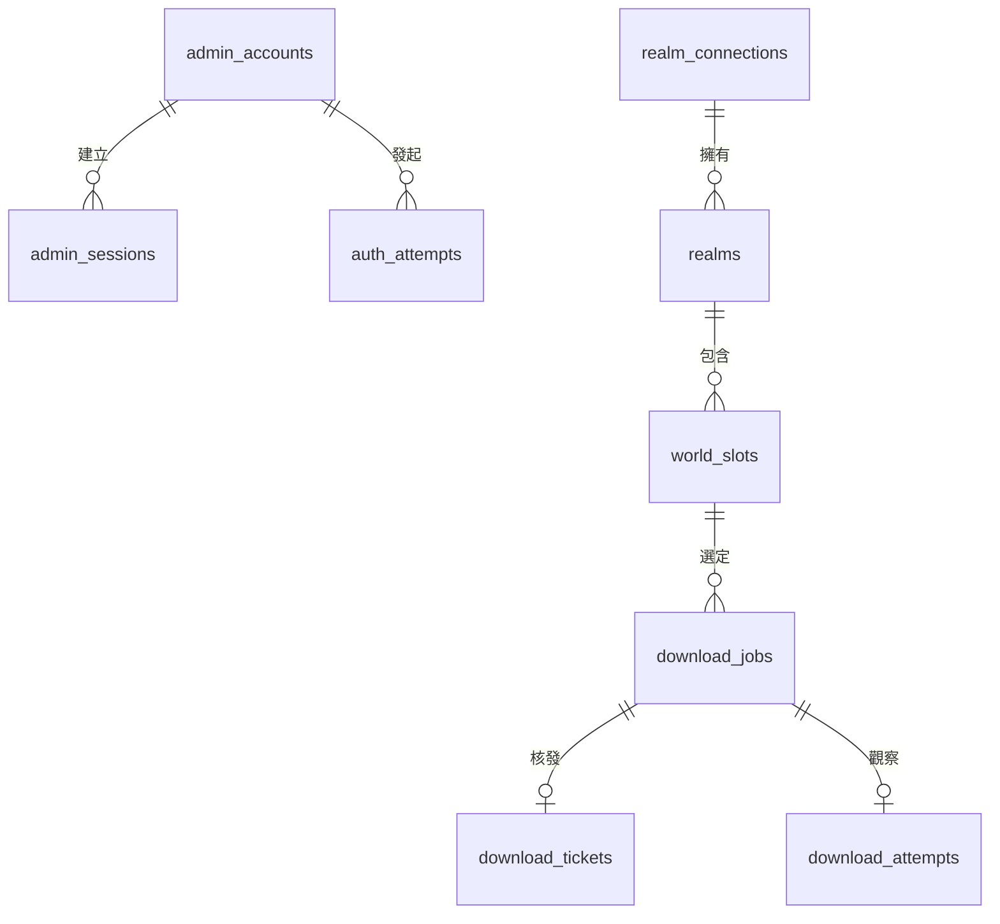

# 資料模型：Realms World

**日期**：2026-09-13

**依據**：[規格](spec.md)、[計畫](plan.md)

**狀態**：邏輯設計已落實於 db/schema.ts 與初始前向遷移；本機 D1 驗證通過，hosted G0 尚待驗證。

## 共通規則

使用 D1 SQLite，UTC epoch 毫秒儲存時間，API 用 ISO 8601，介面以 `Asia/Taipei` 顯示。外部 ID 視為字串，避免 JavaScript number 精度問題。亂數使用密碼學安全來源；列舉及布林值有 CHECK 約束，查詢使用預備語句。

權限直接讀 `env.DB` 主庫；若引入 Sessions，使用 `first-primary`。跨 await 的先讀後寫不是交易；取得權利必須靠帶條件 SQL 的 RETURNING／changes。

## 實體關係

管理員登入與 Microsoft 連線分離；網站登出不解除已完成連線，待完成授權則綁定有效網站工作階段。存檔描述只是外部來源暫時投影，不是持久備份目錄。

## 管理員與工作階段

### admin_accounts

| 欄位 | 規則 |
|---|---|
| id | 固定 1，主鍵與 CHECK，最多一列 |
| username | 2～64 字元，小寫英文字母、數字、底線、點、連字號；唯一 |
| password_hash | 含版本、參數、salt 與衍生結果的 scrypt 封裝 |
| credential_version | 正整數；改密碼或維護重設遞增 |
| created_at／updated_at | UTC 毫秒 |

密碼 15～128 個 Unicode 碼點、UTF-8 最多 1024 bytes，不截斷、trim 或正規化。使用 `scrypt(N=16384,r=8,p=5,maxmem=33554432,keylen=32)`、每次至少 16 bytes 隨機 salt、等時比較。成本須在 G0 實測，不以降低為快速雜湊通關。

### admin_sessions

欄位：`token_digest` 主鍵、`admin_id=1`、`credential_version`、`csrf_digest`、`created_at`、`last_seen_at`、`expires_at`。

32 bytes 隨機不透明 session 的 SHA-256 摘要入庫，原值僅放安全 Cookie。CSRF 原值只給驗證後的管理介面，D1 存摘要。閒置 30 分鐘或建立 12 小時後失效；每次管理請求驗證兩種期限及帳號版本，last_seen_at 續寫同樣包含版本條件。

登出刪除該列；改密碼／重設以 batch 更新雜湊、增加 credential_version 並使全部原有 sessions 失效。一般改密碼以預期版本條件更新，後續只刪除 credential_version 小於等於該預期版本的 sessions；更新 0 筆回 409，不能刪除較新版本的 sessions。維護重設另採下述批次前置斷言，版本衝突時所有寫入回滾。登入在密碼比對後以原 credential_version 條件插入 session，避免重設期間舊密碼仍建立登入。

### maintenance_operations

`operation_digest` 主鍵、`action`（bootstrap／reset）、`performed_at`、`guard_passed`（NOT NULL、CHECK 值為 1）。保存部署維護秘密的單向摘要，不存原值。此防重放摘要不依 30 天紀錄期限清除。

同一 batch 的第一個寫入以 INSERT VALUES 與資料庫內 CASE 計算 guard_passed：bootstrap 必須沒有 id=1 帳號；reset 必須存在 id=1 且 credential_version 等於 expectedCredentialVersion。成立寫 1，不成立寫 0 觸發 CHECK 中止整批；不可改成 INSERT SELECT 的條件不符而插入 0 筆。接著建立／條件更新帳號，reset 刪除全部 sessions。batch 內不夾外部請求，前置斷言與帳號變更不容許其他寫入交錯。

條件衝突與重放唯一約束失敗均整批回滾：不改帳號、不刪 sessions、不新增操作摘要，也不消耗尚未使用的維護秘密。版本衝突回 409；操作者重新讀版本並確認後才可再次操作。只有成功提交才消耗秘密並要求移除部署設定。不能把 UPDATE 影響 0 筆當作會自動回滾的 SQL 錯誤。

## 連線與授權

### realm_connections

固定 `id=1`；解除後仍保留非敏感世代列，避免刪除重建後 generation 回到零。

| 欄位 | 規則 |
|---|---|
| generation | 非遞減整數；開始新連接、取消及解除時推進 |
| status | disconnected、authorizing、connected、reauth_required |
| owner_xuid | 已核對擁有者穩定 ID；解除清空 |
| credential_box | AES-GCM 封裝，可為 null |
| token_version | 成功保存新授權時遞增 |
| refresh_owner／refresh_until | 短期刷新協調，失效可接手 |
| last_verified_at／last_error_code | 核對時間及安全錯誤代碼 |
| updated_at | 狀態變更時間 |

密文封裝含 format_version、key_id、每次新的 12 bytes nonce 及驗證標籤。AES-256-GCM 金鑰在 Sites 秘密，AAD 綁定用途、連線 ID、generation、格式版本。密文只含實際需要的 Microsoft token、Xbox P-256 證明私鑰、device／title／user／XSTS token、cookie 與有效期。

刷新租約初始 30 秒、每個上游 HTTP 最長 10 秒，多段刷新在持有租約時條件續租。回寫必須同時符合 status、generation、token_version、refresh_owner 及未到期條件；其他請求收到可重試的準備中狀態，不忙等。解密失敗或授權明確失效停止新下載；429／5xx 不冒充授權撤回。

### auth_attempts

欄位：`id`、`admin_session_digest`（外鍵指向 admin_sessions.token_digest，ON DELETE CASCADE）、`credential_version`、`connection_generation`、`status`、`stage`、`encrypted_state`、`expires_at`、`next_poll_at`、`poll_owner`、`poll_until`、`created_at`。

狀態為 pending → authorized／cancelled／denied／expired／failed。密文保存 device code、必要 cookie 及分段 Xbox 進度；user code 和官方驗證網址只給目前管理員。每次 step 最多一個外部階段，原子取得短租約並遵守 next_poll_at。網站 session／版本失效、取消或世代改變後，清除秘密並拒絕晚到結果。

stage 為 requesting_code／waiting_for_user／exchanging_tokens。尚未取得官方 challenge 時，userCode 與 verificationUri 皆為 null，初始化期限為 created_at 加 10 分鐘；取得 challenge 後 expires_at 改為官方有效期換算的絕對時間，不因後續輪詢延長。官方有效期也限制後續 token 交換，過期未完成須重新操作。session 刪除會清除關聯授權工作；晚到結果不得重建工作或保存連線。授權與下載 step 租約均初始 30 秒、每個上游 HTTP 最長 10 秒，回寫須符合原租約擁有者、未到期及預期狀態／世代，失敗丟棄中間結果。

### 解除的原子範圍

同一 D1 batch 增加 generation、改 disconnected、清空帳號及 credential_box／刷新租約、清除待授權秘密、所有欄位下架且增加 publication_version、清除未開始下載工作的密文描述及票據，並新增安全紀錄。可能與新連接競爭的語句以預期 generation 約束。新連接須在解除完成後才開始。

## Realm、欄位與存檔

### realms

欄位：`id`、`source_realm_id`、`connection_id=1`、`connection_generation`、`verified_owner_xuid`、`source_name`、`availability`、`fetched_at`。目前世代的 source_realm_id 唯一。

僅保存已核對擁有權的 Realm；受邀項目不能轉成可發布世界。依實際官方回應判定可用性，不只憑到期旗標猜測。

### world_slots

| 欄位 | 規則 |
|---|---|
| id／public_id | 內部主鍵與隨機公開 ID；公開 ID 不包含帳號或 Realm ID |
| realm_id／source_slot_id | 組合唯一，關聯 Realm 及欄位 |
| connection_generation | 對應目前連線 |
| source_identity | latest 模式為已驗證的欄位路由 latest-slot-v1:{realmId}:{slotId}；不是不可變內容 ID 或歷史歸屬證據，未核對為 null |
| association_status | verified、empty、unverifiable、unavailable |
| display_name／description | 純文字 1～100／0～2000 碼點，不改官方資料 |
| published | 預設 false |
| publication_scope | latest／all_archives；預設 latest，目前發布服務只寫 latest |
| publication_version | 發布、下架或歸屬失效時遞增；顯示文字修改不影響 |
| fetched_at／updated_at | 來源取得及設定更新時間 |

目前連線 connected、擁有權正確、欄位存在且非空，並完成官方 latest 描述及來源主機核對後才可發布。最新模式涵蓋該欄位目前及之後的最新內容，包括遊戲中替換後的新內容；欄位消失、Realm 不可用或擁有權失效時下架，不沿用舊票。重新授權可保留顯示文字，但全部欄位仍未發布。

### 存檔投影

欄位：`archive_id`、`world_public_id`、`kind`（latest／backup）、`source_backup_id`、`association_evidence`、`saved_at`、`size_bytes`、`game_version`、`fetched_at`。

latest 是選擇器，不冒充固定歷史 ID；backup 保持原選擇。未知時間／大小／版本為 null；API size_bytes 使用十進位字串。歷史列表需取得完整上游結果，有分頁就遍歷；無法確認完整時明確失敗，不靜默截斷。只短期保存選擇與歸屬證據，準備下載時重新核對。

## 下載工作、票據與觀察

### download_jobs

欄位：`id`、`status_secret_digest`、`world_slot_id`、`connection_generation`、`publication_version`、`selector_kind`、`source_backup_id`、`association_evidence`、`state`、`stage`、`encrypted_descriptor`、`prepare_attempts`、`prepare_auth_retry_used`、`next_poll_at`、`step_owner`、`step_until`、`expires_at`、`status_expires_at`、`safe_error_code`、`created_at`。

建立時產生 32 bytes 狀態秘密，D1 只存摘要，瀏覽頁只在記憶體保存。工作有效 10 分鐘；上游世界準備最多 20 次嘗試，遵守回應間隔，授權內部分段不重複建立世界準備請求。expires_at 固定為 created_at 加 10 分鐘，只限制準備及新兌換；status_expires_at 固定為 created_at 加 30 天，只限制觀察查詢與資料保留，不因輪詢延長。

prepare_attempts 為 NOT NULL 整數、預設 0、CHECK 介於 0～20。即將呼叫一次真正的上游世界準備 HTTP 前，以單一條件 UPDATE／RETURNING 同時檢查 preparing、工作期限、目前世代／發布、next_poll_at、可取得的短租約及 prepare_attempts < 20，再取得租約並加 1。未取得更新不得呼叫上游；逾時、429、程序消失或送出結果不明均不退回次數，冷啟動與接手不能歸零。授權內部分段取得同一工作租約但不增加此計數。第 20 次若仍未就緒則轉 failed，safe_error_code=preparation_limit_reached；成功則可轉 ready，不允許第 21 次或自動建立替代工作。

prepare_auth_retry_used 為 NOT NULL 布林、預設 false。準備端點第一次 401／403 且協定允許續期時，以條件更新設 true、stage 改為 reauthorizing，後續 step 分段續期後才再次準備；該次重送仍須增加 prepare_attempts。再次需要強制續期時終止，不在轉接器內自動刷新並重送。正常到期授權的預先續期不消耗此旗標。第 20 次結果不明且租約已到期時，下次 step 直接標示 preparation_limit_reached，不再呼叫上游；尚有有效租約時只能等待。晚到準備回應必須符合原 step_owner、step_until、preparing、準備期限、目前世代及發布版本才可保存描述或核票。

狀態：preparing → ready → redeeming → streaming → transfer_ended／transfer_failed。準備可轉 failed／expired／invalidated。10 分鐘期限限制準備及新兌換，不因到期中止已開始的串流。缺少可靠終態時保留已觀察階段，紀錄 outcome=unknown，不以逾時推定成功或失敗。

step 與兩道兌換條件均檢查 expires_at；GET status 改查 status_expires_at，並仍驗證 capability、目前連線世代及發布版本。只有 preparing／ready／redeeming 超過準備期限時轉 expired 並禁止開始；已 failed／expired／invalidated 保留原終態與原因，已 streaming／transfer_ended／transfer_failed 保留觀察狀態，不套準備期限。下架／解除／世代失效或觀察期限到期時，公開查詢統一 404；介面顯示無法繼續查詢，不推定傳輸結果或取消既有附件。

encrypted_descriptor 包含上游 URL、Bearer token、到期及必要 headers，使用獨立用途 AAD，只在後端解密。開始串流、失敗、失效或過期即清空，禁止保存世界位元組。

### download_tickets

欄位：`ticket_digest` 主鍵、`job_id` 唯一且外鍵指向 download_jobs.id（ON DELETE CASCADE）、`connection_generation`、`publication_version`、`expires_at`、`used_at`。

32 bytes 原票有效 60 秒，只在轉 ready 的 step 回應一次；狀態查詢不能吐出原票，遺失或過期需重建工作。單一條件 UPDATE／RETURNING 確認未用、未過期、ready、連線有效、欄位仍發布及版本相符，才設 used_at。20 次並行兌換最多一次成功；上游失敗也不復活原票。

收到可用上游檔案後再條件更新 redeeming → streaming，此成功點定義「傳輸已開始」。若下架／解除先提交，更新失敗且取消上游，不能沿用準備前的權限。

### download_attempts

欄位：`id`、`job_id`（NOT NULL、UNIQUE，外鍵指向 download_jobs.id，ON DELETE RESTRICT）、世界／版本安全快照、`requested_at`、`stream_started_at`、`observed_end_at`、`observed_bytes`、`outcome`、`safe_error_code`。

- 工作建立成功即寫請求事件。
- 工作與觀察在同一 batch 建立，created_at 與 requested_at 使用相同時間。工作非敏感列與觀察都保留至該時間加 30 天；不因 10 分鐘準備期限刪除工作或連帶刪除紀錄。
- outcome=unknown 為初始值，包含進行中及缺少證據者，另以階段欄位說明。
- transfer_ended：來源正常 EOF、已讀資料交給輸出串流且無已知取消；已知 Content-Length 必須與觀察 bytes 相符。
- transfer_failed：有確定上游／輸出錯誤、取消、長度不符等證據。
- 結束寫入失敗維持 unknown；訪客回報不能單獨改成 transfer_ended。

任何狀態都不能宣稱訪客已落盤或成功匯入。

### audit_events

欄位：`id`、`created_at`、`category`、`actor`、`world_public_id`、可選安全存檔標籤、`result`、`safe_error_code`、`correlation_id`。涵蓋連接、解除、發布、下架、帳號維護與下載。禁止原始錯誤、秘密、上游 URL、成員名單及原始 IP。

## 限流與清理

rate_limit_windows 以 scope、key_digest、window_start 為組合主鍵，含 count、expires_at。原子 upsert 後判斷限額，來源及全站都計數；不以記憶體變數作跨請求權威。從平台可信來源取得 IP，透過獨立秘密 HMAC 與 UTC 日期產生當日識別；過期窗口最晚 24 小時後可清理。

maintenance_state 保存清理 owner／expires_at，每分鐘至多一批、每批 500 筆。查詢一律先檢查期限，清理失敗留待後續流量，不能使過期資料恢復可讀。

| 資料 | 有效／可讀期限 | 清理 |
|---|---|---|
| 操作與下載紀錄 | 最近 30 天 | 後續請求按時間索引批次刪除 |
| 授權工作秘密 | 官方到期，或取消／完成即失效 | 終止即清空，遺留列按請求清理 |
| 下載工作準備／票據 | 10 分鐘／60 秒，使用後不可再用 | 密文描述在開始／終止／到期時清空；票據到期可清理，工作列保留至觀察期限 |
| 工作狀態查詢與非敏感列 | 建立後 30 天，仍須通過 capability 與發布／世代核對 | 到期先刪觀察，再刪票據與工作；不能以串流狀態延長可讀期限 |
| 網站工作階段 | 閒置 30 分鐘／絕對 12 小時 | 登出／重設即刪，過期列批次刪 |
| 保存的 Microsoft 授權 | 連線有效期間 | 解除立即清空，失效不提供新下載 |
| 維護防重放摘要 | 持續有效 | 不依一般紀錄期限刪除 |

每批總共最多異動 500 筆資料列，依外鍵順序先刪超過 30 天的 download_attempts，再刪相應票據與工作；可分批留下暫時無觀察的到期工作，不得先刪仍有期限內紀錄的父列。30 天內即使準備期限已過，仍保留串流觀察列；超過 30 天則停止查閱並允許清理，即使最後階段仍為 streaming。此時既有串流繼續傳輸，晚到終態只能更新仍在期限內的既有列，不能重新插入已清理紀錄或推定失敗。

索引包含 session 到期／管理員版本、授權工作到期、Realm／欄位唯一鍵、發布與世代、工作準備到期／status_expires_at／狀態、票據摘要／到期、紀錄時間／世界、限流到期。D1 平台備份與應用程式可查閱期限不同，不宣稱刪除活動列會清除平台全部備份。

2026-09-14 新增 publication_scope 使用單一 ALTER TABLE ADD COLUMN 前向遷移，既有資料預設 latest，不重建或刪除資料表。建立工作及每個最後權限判斷均檢查範圍；latest 工作另比對 source_identity 與 association_evidence。
