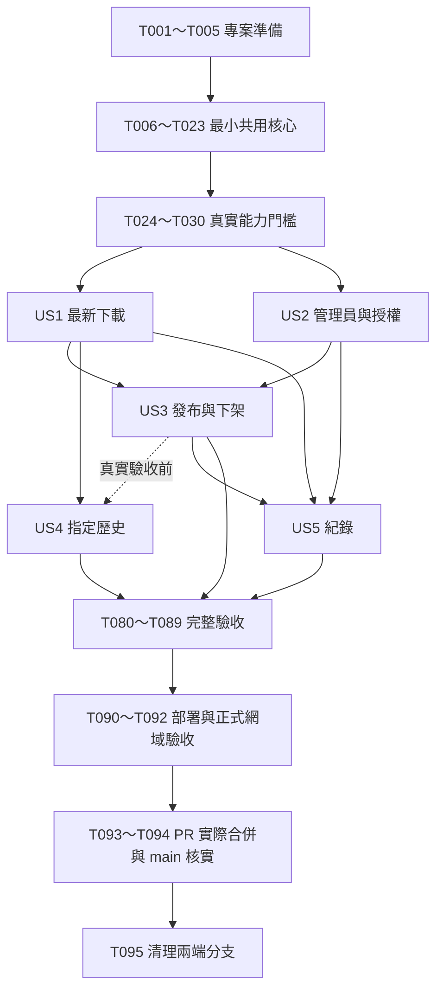

# 任務清單：Realms World 公開世界下載站

**日期**：2026-09-13

**分支**：`001-realms-world-downloads`

**輸入**：[功能規格](spec.md)、[技術計畫](plan.md)、[研究](research.md)、[資料模型](data-model.md)、[HTTP 契約](contracts/http-api.md)、[轉接器契約](contracts/realms-adapter.md)、[維護契約](contracts/maintenance.md)、[快速開始](quickstart.md)。

**治理依據**：[專案憲章 v2.0.0](../../.specify/memory/constitution.md)。

**目前狀態**：共 95 項任務，全部尚未執行。建立此清單不等於完成應用程式、部署、真實授權或驗收；現有草稿 PR #1 持續用於本功能。

## 格式與執行規則

- 每項採 `- [ ] Tnnn [P] [USn] 描述與檔案路徑`；[P] 僅標記同一就緒批次可平行的工作，非每個任務必備。
- [US1]～[US5] 對應規格的五個故事；準備、共用基礎與跨功能階段不標故事。
- 任務中的程式／證據路徑皆相對儲存庫根目錄。列出的未存在程式與 validation 文件是未來產出，本次不建立空程式或假證據。
- 每階段入口條件滿足後，未標 [P] 的任務依序執行；平行任務必須不同檔案且沒有彼此依賴，實際批次列於後文。
- 測試來源為規格明列的 SC-001～SC-010、驗收情境及憲章 V；本清單不對無關的小改動新增測試。故事內先建立對應失敗案例，再實作，結束時全部相關案例須通過。環境無法執行不算通過。
- G0 允許最小安全登入、授權、資料與串流核心，以驗證平台可行性；US2 等後續故事承接共用實作，不能重建另一套授權／帳號／下載核心。
- 任一真實驗收需要管理員親自授權或遊戲內確認時，保留待完成並明確記錄；不得以人工 fixture、文件研究或 HTTP 200 代替。
- 每次改動影響真實測試程式／設定時，先保存 Git 提交、更新同一 Sites 版本再實測，證據必須對應實際執行版本。
- 正式功能開放前必須完成全部必要故事與驗收；US1 是可獨立測試的第一個垂直切片，並非可以刪除歷史、管理或紀錄要求的正式最小版本。

## 第 1 階段：專案準備

**目的**：建立單一 Sites 專案與可重現工具鏈，保留現有 SDD 和 Git。

**入口／檢查點**：完成本階段後才進入共用基礎。此處所有任務均待實作，不因目前已具備 Git 或文件而預先勾選。

- [ ] T001 先完成 spec／plan／tasks 一致性審查，將可執行的阻斷問題與修正記錄於 `specs/001-realms-world-downloads/validation/analysis.md`；確認憲章 v2.0.0、分支 `001-realms-world-downloads` 與既有草稿 PR #1，未解決的必要問題不得帶入實作。
- [ ] T002 在 `package.json`、`package-lock.json`、`vite.config.ts` 與 `.gitignore` 整合 Sites starter；先取得受支援的 npm、使用 Node 22.13.0 以上與鎖定依賴、啟用 nodejs_compat，先忽略秘密與本機資料；暫存 starter 只合併必要新檔，不覆蓋 `.agents/`、`.specify/` 或 Git。
- [ ] T003 在 `.openai/hosting.json`、`lib/security/env.ts` 與 `.env.example` 宣告單一 Site、D1 DB 與維護契約中的設定鍵；DOWNLOADS_ENABLED 預設 false，缺少必要來源版本／精確主機時拒絕該能力，秘密只列鍵名，GitHub 保持 origin。
- [ ] T004 [P] 在 `vitest.config.ts`、`playwright.config.ts`、`package.json` 設定 Vitest 4.1 以上與 @cloudflare/vitest-plugin、Playwright、check／test:unit／test:integration／test:e2e／test:stream／build 入口；預設測試不呼叫真實 Microsoft 或 Realms。
- [ ] T005 [P] 在 `tests/fixtures/realms.ts`、`tests/fixtures/streams.ts` 與 `tests/fixtures/clock.ts` 建立人工擁有／受邀 Realm、兩欄位、多份歷史、未知資訊及可控時間／錯誤／即時串流來源；禁止真實秘密、下載 URL 或世界副本入庫。

## 第 2 階段：共用基礎與 G0 必要能力驗證

**目的**：只建立能力驗證所需的共用模型、最小安全登入、授權及串流核心；正式使用者故事必須等待 G0 通過。

**入口／檢查點**：T006～T029 可建立最小驗證程式及必要共用核心，不建立完整產品頁面。T030 未通過時，T031 之後全部停止；等待真實授權或遊戲匯入不是完成。

- [ ] T006 在 `db/schema.ts` 定義 admin_accounts、admin_sessions、maintenance_operations 全部欄位：id「固定 1，主鍵與 CHECK，最多一列」；username「2～64 字元，小寫英文字母、數字、底線、點、連字號；唯一」；password_hash「含版本、參數、salt 與衍生結果的 scrypt 封裝」；credential_version「正整數；改密碼或維護重設遞增」；時間「UTC 毫秒」；token_digest／operation_digest 為主鍵、admin_id=1、action 限 bootstrap／reset，防重放摘要不依 30 天期限刪除。
- [ ] T007 在 `db/schema.ts` 加入 realm_connections、auth_attempts、realms、world_slots 全部欄位與關聯：connection id=1，generation「非遞減整數；開始新連接、取消及解除時推進」，status「disconnected、authorizing、connected、reauth_required」，credential_box「AES-GCM 封裝，可為 null」，owner_xuid「已核對擁有者穩定 ID；解除清空」，token_version「成功保存新授權時遞增」；auth_attempts「狀態為 pending → authorized／cancelled／denied／expired／failed」。
- [ ] T008 在 `db/schema.ts` 補齊欄位與存檔約束、在 `lib/realms/types.ts` 定義存檔投影：Realms「目前世代的 source_realm_id 唯一」；public_id「內部主鍵與隨機公開 ID；公開 ID 不包含帳號或 Realm ID」，realm_id／source_slot_id「組合唯一，關聯 Realm 及欄位」，connection_generation「對應目前連線」，source_identity「可靠的官方內容辨識投影；無法確認為 null」，association_status「verified、empty、unverifiable、unavailable」，display_name／description「純文字 1～100／0～2000 碼點，不改官方資料」，published「預設 false」，publication_version「發布、下架或歸屬失效時遞增；顯示文字修改不影響」，fetched_at／updated_at「來源取得及設定更新時間」；存檔 kind 限 latest／backup，「未知時間／大小／版本為 null；API size_bytes 使用十進位字串」。
- [ ] T009 在 `db/schema.ts` 加入 download_jobs、download_tickets、download_attempts、audit_events、rate_limit_windows、maintenance_state 全部欄位與索引，ticket_digest 為主鍵、job_id 唯一；jobs「狀態：preparing → ready → redeeming → streaming → transfer_ended／transfer_failed。準備可轉 failed／expired／invalidated。」；attempts「outcome=unknown 為初始值，包含進行中及缺少證據者，另以階段欄位說明。」；rate_limit_windows「以 scope、key_digest、window_start 為組合主鍵」；加入所有時間／世界／狀態／世代／到期索引與 CHECK／外鍵，產生 `drizzle/0000_realms_world.sql` 及 db:migrate:local，驗證新資料庫可重建且不修改已套用遷移。
- [ ] T010 [P] 在 `tests/integration/security-primitives.test.ts` 先寫唯一管理員、條件登入、session 到期／版本、CSRF、重放 batch 回滾、D1 主庫權限、加密驗證標籤與限流競爭的失敗測試，禁止用記憶體計數假裝跨請求一致性。（FR-008、FR-009、FR-019、FR-020、FR-021）
- [ ] T011 [P] 在 `tests/unit/realms-protocol.test.ts` 先寫 expires_in 秒／毫秒、P-256 簽章固定向量、裝置碼降速、Realm 擁有權、兩欄位歸屬、完整歷史分頁與非作用中欄位的失敗測試。（FR-011、FR-012、FR-014、FR-019）
- [ ] T012 [P] 在 `tests/integration/stream-primitives.test.ts` 先寫未知大小、背壓、前綴 bytes 不遺失、來源取消、HTML／JSON／206 拒絕、精確主機與每跳 redirect 授權隔離的失敗測試。（FR-007、FR-020、FR-023、FR-024）
- [ ] T013 在 `lib/db/client.ts`、`lib/db/conditional-writes.ts` 建立預備語句、D1 batch、RETURNING／changes 與結果不明處理；UTC epoch 毫秒、外部 ID 字串、權限讀主庫或 first-primary，禁止跨 await 的先讀後寫冒充交易；提供世代、發布版本與一次性票據的原子條件原語。
- [ ] T014 在 `lib/security/request-policy.ts`、`lib/security/rate-limit.ts`、`lib/security/errors.ts` 建立精確 Origin、JSON 16 KiB／表單 4 KiB、CSRF、no-store／nosniff／no-referrer、公開錯誤遮蔽及原子限流；登入每來源 5／全站 20 次每 15 分鐘，建立下載每來源 6／全站 30 次每分鐘，狀態每工作 30 次每分鐘，其他公開 API 每來源 120 次每分鐘；HMAC 日更來源識別，不記原始 IP。（FR-019～FR-023）
- [ ] T015 在 `lib/auth/password.ts` 與 `lib/security/crypto-box.ts` 實作「密碼 15～128 個 Unicode 碼點、UTF-8 最多 1024 bytes，不截斷、trim 或正規化。」及「scrypt(N=16384,r=8,p=5,maxmem=33554432,keylen=32)」、「每次至少 16 bytes 隨機 salt、等時比較」；AES-256-GCM 封裝「含 format_version、key_id、每次新的 12 bytes nonce 及驗證標籤」，AAD 綁定用途／連線 ID／generation／格式版本，金鑰與 D1 分開，解密失敗拒絕下載。
- [ ] T016 在 `scripts/admin-maintain.mjs`、`lib/auth/session.ts`、`lib/auth/maintenance.ts`、`app/api/admin/login/route.ts`、`app/api/admin/session/route.ts`、`app/api/maintenance/admin/route.ts`、`app/api/maintenance/admin/version/route.ts` 建立 G0 所需最小無密碼回顯初始化 CLI、登入／初始化與版本查詢；「32 bytes 隨機不透明 session 的 SHA-256 摘要入庫，原值僅放安全 Cookie。」、「閒置 30 分鐘或建立 12 小時後失效」；CSRF 只存摘要，登入條件寫入 credential_version，維護秘密一次性 batch，缺失／錯誤秘密一致 404，不提供匿名註冊。
- [ ] T017 在 `lib/realms/microsoft-auth.ts`、`lib/realms/xbox-auth.ts` 實作 beginDeviceLogin／advanceDeviceLoginOnce；沿用 research.md 固定 live／Nintendo title、Microsoft 官方裝置碼與 Realms 專用 relying party，分次保存加密 device code／cookie／P-256 證明，依 next_poll_at 推進一次外部階段，取消／拒絕／到期清秘密。
- [ ] T018 在 `lib/realms/authorization.ts` 與 `lib/db/connections.ts` 實作 getValidRealmsAuthorization、token 保存與解除原語；「刷新租約初始 30 秒、每個上游 HTTP 最長 10 秒」，回寫檢查 status／generation／token_version／owner／期限，超時可接手；解除 batch 清授權與待完成描述、增加世代、下架並失效票據，晚到結果不得復活連線，429／5xx 不冒充撤權。
- [ ] T019 在 `lib/realms/client.ts`、`lib/realms/ownership.ts`、`lib/realms/archives.ts` 實作 listOwnedRealms／listWorldSlots／listBackupsForVerifiedSlot／prepareWorldDownload；原始碼只作協定參考，無證據一律 slot_unverifiable，禁止以 slotId 包裝 Realm 級備份或切換作用中欄位；預留 T026 實測後完成的可信映射，不先填猜測版本／主機。
- [ ] T020 在 `lib/security/download-source.ts` 與 `lib/downloads/stream.ts` 實作 openValidatedDownload：來源僅後端 Realms 回應、HTTPS 精確主機／443、manual redirect 最多 3 跳且逐跳重驗，Bearer 不任意跨主機轉送；最多 4 KiB 前綴驗證後完整交付，持續背壓／取消，禁止整檔 Buffer／Blob、tee 未消費分支、世界儲存與下載心跳租約。
- [ ] T021 在 `lib/db/downloads.ts` 實作工作／票據的原子核心；「建立時產生 32 bytes 狀態秘密，D1 只存摘要，瀏覽頁只在記憶體保存。」；「工作有效 10 分鐘；上游世界準備最多 20 次嘗試」；票據「32 bytes 原票有效 60 秒，只在轉 ready 的 step 回應一次」；原子消耗與最終 redeeming → streaming 兩道權限條件，上游失敗不復活票據，準備期限不截斷已開始串流。
- [ ] T022 在 `lib/audit/writer.ts` 建立請求、操作與傳輸安全紀錄原語，供 G0 及各故事共用；開始前請求須落庫、未知為預設，只有實際 EOF／錯誤證據可改結果；「禁止原始錯誤、秘密、上游 URL、成員名單及原始 IP。」；所有讀取先限最近 30 天，不能等到 US5 才保護或記錄資料。
- [ ] T023 在 `app/admin/verification/page.tsx` 與 `app/api/admin/verification/[operation]/route.ts` 建立最小管理員驗證入口，重用 T013～T022 的正式核心與同源／CSRF 保護，逐段操作授權、欄位、一次性票據及原生串流；DOWNLOADS_ENABLED=false 不阻止此受保護入口，但不能開放匿名或任意 URL／SQL 探測。
- [ ] T024 執行基礎測試後將最小程式保存為 Git 提交，在同一 Sites 的受保護驗證部署實測 D1 binding／batch／條件寫入、部署秘密與 scrypt CPU／記憶體／外部延遲；於 `specs/001-realms-world-downloads/validation/g0-platform.md` 記錄提交／Site 版本／配額及受保護 D1 維護能力，不能用本機成功替代 hosted 結果或降低雜湊成本。
- [ ] T025 由管理員親自使用 Microsoft 官方頁面完成裝置碼，驗證跨獨立請求／冷啟動／新網站登入重用與一次真實 refresh token 續期及 XSTS 重建；在 `specs/001-realms-world-downloads/validation/g0-auth.md` 記錄通過／失敗／未執行、取消／拒絕／降速／到期結果，不寫 token。（SC-003）
- [ ] T026 以真實擁有者、至少兩個可區辨欄位及非作用中欄位核對最新／歷史歸屬與完整列表，排除受邀 Realm；將可靠映射落實於 `lib/realms/ownership.ts`、`lib/realms/archives.ts` 並更新相關測試，於 `specs/001-realms-world-downloads/validation/g0-association.md` 記錄 Client-Version、精確來源主機／redirect 與安全欄位證據；無法證明就維持拒絕並阻擋 G0。
- [ ] T027 透過同一 Sites 驗證入口下載一份最新、一份不同歷史及實際最大世界（可重用符合條件的同一次下載），由管理員至少匯入一份至相容基岩版並核對內容；於 `specs/001-realms-world-downloads/validation/g0-downloads.md` 記錄版本、大小、耗時與使用者確認，世界檔只留驗收裝置。（SC-002、SC-006）
- [ ] T028 在 `scripts/verify-stream.mjs` 與 `tests/integration/stream-load.test.ts` 建立即時串流計數／雜湊驗證，再於 Sites 執行 3 個各至少 1 GiB 串流及 20 次並行頁面操作、慢速／未知大小／斷線測試；將記憶體、CPU、前置層是否截斷與無世界副本證據寫入 `specs/001-realms-world-downloads/validation/g0-streams.md`。（SC-006）
- [ ] T029 在 `tests/integration/g0-races.test.ts` 驗證同票 20 次兌換最多一次、刷新與解除、取消後晚到授權、重設與舊登入、下架再發布舊票、D1 結果不明及結束紀錄寫入失敗；在 Sites 以人工安全資料執行相同原子核心，結果寫入 `specs/001-realms-world-downloads/validation/g0-races.md`，不以本機記憶體鎖代替 D1。（SC-004、SC-007、SC-009）
- [ ] T030 彙整 T024～T029 至 `specs/001-realms-world-downloads/validation/g0.md`，逐一核對計畫 G0 門檻與憲章 V；只有全部必要項目具實際通過證據才勾選本任務。能力失敗或缺授權／歷史／匯入確認時保留未完成，記錄阻斷原因，不開始完整故事、不另加主機或取消核心需求。

## 第 3 階段：使用者故事 1－訪客下載公開世界的最新存檔（P1）

**目的**：匿名訪客由公開列表取得所選世界的最新 .mcworld，具即時準備回饋、安全串流及可理解錯誤。

**獨立驗證**：使用受控且已發布的人工世界資料獨立測試，不依賴後台 UI；首頁最多 3 次主要操作，20 次選擇均下載正確世界，未知資料、空列表、未公開／失效票據與中斷均如實處理。真實正式交付另依賴 US2、US3 及最終驗收。

### 測試

- [ ] T031 [P] [US1] 在 `tests/integration/public-download-api.test.ts` 先寫公開列表／詳情／建立工作／step／status／兌換契約測試，涵蓋匿名、只見已發布世界、未知欄位、準備回饋、票據重放、capability 不可列舉與一致 404。（FR-001～FR-005、FR-018～FR-023）
- [ ] T032 [P] [US1] 在 `tests/integration/download-failures.test.ts` 先寫上游 429／5xx／準備中／無效附件、未知長度／中文檔名／來源取消、最終發布檢查與下架競爭的測試，確定失敗不成 .mcworld、不換世界或追加 JSON。（FR-007、FR-021～FR-024）

### 實作與驗收

- [ ] T033 [US1] 在 `lib/downloads/types.ts` 與 `lib/realms/public-projection.ts` 定義 PublicWorld／Archive／Selection 投影及輸入驗證，kind 限 latest／backup、PublicWorld availability 限 available／temporarily_unavailable；承接「未知時間／大小／版本為 null；API size_bytes 使用十進位字串。」及 latest 選擇器，fetchedAt 不冒充存檔時間，不輸出帳號、Realm ID 或成員。
- [ ] T034 [US1] 在 `lib/realms/public-catalog.ts` 實作主庫發布／連線篩選、最新來源重新核對、空狀態與服務不可用區分；來源更新反映於新查詢，仍有發布設定但授權失效不能假裝空列表，未知／未公開 ID 統一拒絕。（FR-002、FR-003、FR-004、FR-019）
- [ ] T035 [US1] 在 `lib/downloads/jobs.ts` 完成 preparing／ready／redeeming／streaming／終態協調，重用 T021 期限與票據原語；每個 step 一個外部階段、短租約、next_poll_at、無間隔時 5 秒、最多 20 次世界準備，不自動重建工作；狀態秘密只供目前頁面、票據只回一次，失效／到期清加密描述。
- [ ] T036 [US1] 在 `lib/downloads/redeem.ts` 與 `lib/downloads/filename.ts` 完成原子消耗、取得有效上游後再次條件更新才能開始串流；安全中文／ASCII fallback 檔名含 latest 或歷史辨識，不捏造日期、拒絕 CR／LF／路徑字元，未知大小不補 Content-Length；連接 T020 串流及 T022 請求／結束／失敗觀察。（FR-005、FR-018、FR-023、FR-024、FR-026）
- [ ] T037 [US1] 在 `app/api/worlds/route.ts` 與 `app/api/worlds/[worldId]/route.ts` 提供 GET 列表／詳情，套用公開限流、統一錯誤與 no-store；DOWNLOADS_ENABLED 為公開下載總開關，不能只由前端按鈕限制。（FR-001～FR-004、FR-019、FR-020）
- [ ] T038 [US1] 在 `app/api/worlds/[worldId]/downloads/route.ts`、`app/api/downloads/[jobId]/step/route.ts`、`app/api/downloads/[jobId]/route.ts` 提供 POST 建立／step 與 GET status；建立先寫請求再回 202，step／status 驗證 X-Download-Capability、到期／世代／發布，Retry-After 誠實回傳，GET 不取回原票。（FR-021、FR-022）
- [ ] T039 [US1] 在 `app/api/downloads/redeem/route.ts` 提供同源原生表單 POST 附件，票據只在 body；200 application/octet-stream、UTF-8 檔名、no-store，開始前錯誤為無附件標頭的繁體中文 HTML，開始後串流失敗不追加錯誤內容，Range 不提供斷點續傳。
- [ ] T040 [US1] 在 `components/DownloadButton.tsx` 與 `components/DownloadStatus.tsx` 實作立即準備回饋、受節流的 step／status、僅記憶體 capability、原生 form POST 至獨立命名視窗／分頁；處理彈出受限、失效與手動重試，不用 fetch().blob()，頁面關閉不應取消已交給瀏覽器的原生下載。
- [ ] T041 [US1] 在 `app/layout.tsx`、`app/page.tsx`、`app/worlds/[worldId]/page.tsx` 與 `components/WorldCard.tsx` 完成繁體中文列表／世界頁、純文字名稱／說明、來源取得時間、未知資訊、空／載入／不可用與最新下載入口；頁面加入官方最新不等於未儲存進度的說明。（FR-001～FR-005、FR-027）
- [ ] T042 [US1] 將 T031～T041 連接為獨立可測流程，在 `tests/e2e/latest-download.spec.ts` 驗證真正瀏覽器附件下載而非 Blob、中文檔名、錯誤頁返回、前端 2 秒回饋與伺服器觀察結果；只對人工 fixture 啟用本機匿名下載，測試資料不進入正式公開列表。
- [ ] T043 [US1] 執行 US1 測試及 20 次最多 3 個主要操作的選擇驗收，將結果、來源版本與限制寫入 `specs/001-realms-world-downloads/validation/us1.md`；確認每次取得所選世界、頁面可操作且無持久世界副本，未通過項目保持未完成。（SC-001、SC-005、SC-007）

**故事完成條件**：相關測試通過、獨立驗證有實際結果、證據文件沒有把未執行標為通過。完整第一版仍須其他必要故事及跨功能驗收。

## 第 4 階段：使用者故事 2－管理員登入並連接自己的 Realms（P1）

**目的**：唯一管理員能初始化／登入／登出／改密碼、連接／續期／解除自己的 Realms，授權與工作階段可撤銷。

**獨立驗證**：使用預先建立的唯一管理員及可控授權狀態，不必發布任何世界；錯誤登入、第二管理員、過期 session、舊密碼競爭、取消／續期失敗／解除皆拒絕，不洩露秘密；真實新登入及續期另外驗收。

### 測試

- [ ] T044 [P] [US2] 在 `tests/integration/admin-account.test.ts` 先寫 login／session／logout／password、bootstrap／version／reset 契約與競爭測試；涵蓋同源／CSRF、5／20 次登入限流、同等失敗訊息、15～128 碼點密碼、12 小時／30 分鐘期限、一次性維護秘密與舊登入／重設競爭。（FR-008～FR-010、FR-020、FR-021）
- [ ] T045 [P] [US2] 在 `tests/integration/admin-connection.test.ts` 先寫連接／step／取消／解除／世界核對契約測試，涵蓋失效 session 啟動的未完成授權、refresh 互斥、晚到回寫、解密失敗、受邀 Realm 及重新連接不發布。（FR-011～FR-015）

### 實作與驗收

- [ ] T046 [US2] 承接 T016 的核心，在 `app/api/admin/logout/route.ts`、`app/api/admin/password/route.ts` 及 `lib/auth/account.ts` 完成登出／驗舊密碼後改密碼／全部工作階段失效，回清 Cookie；登入與 session 路由通過完整版本／期限／CSRF／一般失敗訊息契約，不另建第二套帳號系統。
- [ ] T047 [US2] 在 `scripts/admin-maintain.mjs` 與 `lib/auth/maintenance.ts` 補齊 bootstrap／reset 互動流程及 npm admin:maintain 入口；無回顯密碼、不從指令列接秘密、固定 scrypt 封裝、expectedCredentialVersion 競爭、唯一 operation_digest 與帳號變更同一 batch，成功後移除 Sites 維護秘密並部署生效，失敗不盲目重設。
- [ ] T048 [US2] 在 `app/api/admin/connection/attempts/route.ts`、`app/api/admin/connection/attempts/[attemptId]/step/route.ts`、`app/api/admin/connection/attempts/[attemptId]/route.ts` 完成建立、分次查詢及取消授權，重用 G0 轉接器；user code／官方 verificationUri 只給建立者的有效 session，取消／拒絕／到期清密文，既有連線須先解除。
- [ ] T049 [US2] 在 `app/api/admin/connection/route.ts` 與 `lib/realms/connection-service.ts` 提供安全連線狀態及完整解除 batch，清保存授權／待完成工作／下載描述、下架欄位、失效票據、寫安全紀錄；重複解除可 204、網站登出不解除 Microsoft，重新連接不自動發布。（FR-012、FR-013、FR-015）
- [ ] T050 [US2] 在 `app/api/admin/worlds/route.ts`、`app/api/admin/worlds/refresh/route.ts` 與 `lib/realms/sync-owned-worlds.ts` 提供已核對擁有者 Realm／欄位清單及手動刷新，標示空欄位／不可用原因及 fetchedAt，受邀項目不可發布；來源失敗明確回錯誤，不假裝無世界。
- [ ] T051 [US2] 在 `app/admin/layout.tsx`、`app/admin/login/page.tsx` 與 `components/AdminSession.tsx` 完成自製帳密登入、session 失效與登出導覽；正確 Cookie／CSRF 流程，手機及鍵盤可操作，不出現 ChatGPT 登入或公開註冊入口。
- [ ] T052 [US2] 在 `app/admin/connection/page.tsx` 與 `components/MicrosoftConnection.tsx` 完成官方裝置碼開啟、分次輪詢、降速／逾時／取消／拒絕、連線需恢復及解除互動；解除說明世界將下架，不暗示撤銷其他應用授權或回收已下載檔案。
- [ ] T053 [US2] 在 `app/admin/password/page.tsx` 與 `components/PasswordForm.tsx` 完成驗證目前密碼後修改、長度／UTF-8 錯誤提示與成功後重新登入；不回填、記錄或持久快取密碼。
- [ ] T054 [US2] 在 `lib/security/key-rotation.ts`、`scripts/rotate-auth-keys.mjs` 完成受保護的批次解密重封裝與條件寫入，透過 T024 已驗證的 Sites D1 維護能力執行；保留必要舊 key，所有引用遷移或短期秘密到期後才移除舊 key，無法解密拒絕下載，不新增公開讀取密文端點。
- [ ] T055 [US2] 在 `tests/e2e/admin-account-connection.spec.ts` 驗證管理員全流程並執行相關整合測試；以真實 Sites 再驗證新網站登入仍可取 Realm、一次續期與解除，再連接保持下架，將版本／結果寫入 `specs/001-realms-world-downloads/validation/us2.md`。（SC-003、SC-004）

**故事完成條件**：相關測試通過、獨立驗證有實際結果、證據文件沒有把未執行標為通過。完整第一版仍須其他必要故事及跨功能驗收。

## 第 5 階段：使用者故事 3－管理員選擇公開世界並隨時下架（P1）

**目的**：逐欄位設定網站名稱／說明與發布狀態，發布包含全部可用歷史；下架及歸屬失效後舊入口不能提供新下載。

**獨立驗證**：以同 Realm 兩欄位及另一個未公開 Realm 為受控資料，只發布選定欄位；測試新／重新連接預設私有、版本衝突、跨欄位、下架舊票及不修改官方世界。管理 API 以受控有效 session 可獨立測試。

### 測試

- [ ] T056 [P] [US3] 在 `tests/integration/publication.test.ts` 先寫顯示設定／發布 API、expectedVersion、acknowledgeAllArchives、新欄位私有、歸屬／擁有權改變與舊票據競爭測試，下架不能依賴上游成功回應。（FR-016～FR-020）
- [ ] T057 [P] [US3] 在 `tests/e2e/publication.spec.ts` 先寫管理員只發布一個欄位、歷史公開告知、改網站文字不改官方名稱、下架舊畫面與重新連接的互動案例。（SC-004、SC-008）

### 實作與驗收

- [ ] T058 [US3] 在 `lib/db/world-slots.ts` 完成穩定隨機 public_id、目前世代／欄位組合唯一、同步時只保留網站文字、重新連接全部未發布；欄位內容替換或歸屬失效時增加 publication_version 並下架，公開查詢不得等快取過期才拒絕。
- [ ] T059 [US3] 在 `lib/realms/display-settings.ts` 實作顯示文字驗證與更新，沿用「純文字 1～100／0～2000 碼點，不改官方資料」；不影響 publication_version、不呼叫 Realm 寫入端點，純文字呈現避免 HTML 注入。
- [ ] T060 [US3] 在 `lib/realms/publication.ts` 實作明確發布／下架：發布前核對 connected／擁有權／verified 且非空，要求歷史公開確認及 expectedVersion；下架直接主庫條件提交、增加版本並失效未開始工作／票據，與授權解除及傳輸開始競爭時保持一致。
- [ ] T061 [US3] 在 `app/api/admin/worlds/[worldId]/route.ts` 與 `app/api/admin/worlds/[worldId]/publication/route.ts` 提供 PATCH 顯示設定與 PUT 發布，均驗有效管理員／CSRF，衝突 409，操作紀錄不含私人上游內容。
- [ ] T062 [US3] 在 `app/admin/worlds/page.tsx` 與 `components/WorldPublicationForm.tsx` 完成 Realm／欄位、空欄位／不可發布原因、純文字設定及發布／下架；發布前說明最新、全部現存及未來可用歷史皆公開，下架後刷新狀態及版本。（FR-016、FR-017、FR-018、FR-027）
- [ ] T063 [US3] 執行兩欄位隔離、跨 Realm、下架／重新發布舊票、欄位替換與解除的驗收，將 API／瀏覽器結果與未公開外洩數寫入 `specs/001-realms-world-downloads/validation/us3.md`，外洩必須為 0；與 US1／US2 的真實整合維持發布範圍一致。（SC-004）

**故事完成條件**：相關測試通過、獨立驗證有實際結果、證據文件沒有把未執行標為通過。完整第一版仍須其他必要故事及跨功能驗收。

## 第 6 階段：使用者故事 4－訪客選擇歷史存檔下載（P2）

**目的**：顯示公開欄位所有官方仍提供、歸屬正確的歷史版本，選定版本不可被替換。

**獨立驗證**：受控公開世界含多份、缺時間／大小／版本及已失效存檔；完整列出、已知時間新到舊、未知置末且明示，選擇歷史不能轉成 latest，存檔消失及跨欄位拒絕；另完成不同歷史真實下載。

### 測試

- [ ] T064 [P] [US4] 在 `tests/integration/history-api.test.ts` 先寫歷史列表與指定版本下載契約、原子發布核對、來源移除 410 及未知／未公開一致 404，歷史不得自動替換。（FR-003、FR-006、FR-019、FR-022）
- [ ] T065 [P] [US4] 在 `tests/unit/archive-list.test.ts` 先寫完整分頁、去重、已知時間排序／未知末尾、缺資料 null、歸屬證據失效及新版出現的測試，禁止截斷清單後回 complete=true。

### 實作與驗收

- [ ] T066 [US4] 在 `lib/realms/archive-catalog.ts` 完成 G0 已證實轉接器的公開歷史投影，完整遍歷並去重、依已知時間新到舊、未知明示；大小用十進位字串，無法核對完整性或歸屬就回不可用，不持久保存世界或過期備份目錄。
- [ ] T067 [US4] 在 `app/api/worlds/[worldId]/archives/route.ts` 提供 GET 全部可用歷史、fetchedAt 與 complete=true，主庫先驗發布，再對已公開欄位回具體來源錯誤；真空清單與服務不可用明確區別。
- [ ] T068 [US4] 在 `lib/downloads/history-selection.ts` 與 `lib/downloads/jobs.ts` 對 backup 選擇完成目前欄位歸屬再驗證，工作／票據綁定 source_backup_id 與證據；重新取得來源時仍維持原選擇，410 不退回 latest，不另建繞過 US1 票據的下載路徑。
- [ ] T069 [US4] 在 `components/ArchiveList.tsx` 實作完整歷史列表、可辨識版本及未知資訊、準備／消失／重試狀態、官方可能移除存檔的說明，使用共用原生下載按鈕而非 Blob。
- [ ] T070 [US4] 在 `app/worlds/[worldId]/page.tsx` 整合最新與歷史選擇，支援手機、鍵盤及文字放大，刷新後納入新版本但不改變已指定下載的版本；在 `tests/e2e/history-download.spec.ts` 驗證上述操作。
- [ ] T071 [US4] 執行人工歷史完整性／錯誤測試，並透過真實 Sites 完成與最新不同的歷史下載、核對欄位與內容；在 `specs/001-realms-world-downloads/validation/us4.md` 記錄版本／大小與結果，沿用或補齊真實基岩版匯入證據。（SC-002、SC-007）

**故事完成條件**：相關測試通過、獨立驗證有實際結果、證據文件沒有把未執行標為通過。完整第一版仍須其他必要故事及跨功能驗收。

## 第 7 階段：使用者故事 5－管理員理解下載結果與服務狀態（P2）

**目的**：管理員查看最近 30 天安全操作／下載紀錄，明確區分請求、傳輸結束、確定失敗與結果不明。

**獨立驗證**：直接注入安全事件與受控串流結果即可獨立驗證；正常 EOF、確定取消、終態寫入失敗與期限邊界分別呈現正確結果，游標不能讀到超過 30 天資料，沒有「已匯入」宣稱。

### 測試

- [ ] T072 [P] [US5] 在 `tests/integration/audit-retention.test.ts` 先寫紀錄 API 權限／參數、30 天查詢／游標邊界、每批 500 筆清理及保留防重放摘要測試，清理失敗不恢復過期資料可讀。（FR-025、FR-027）
- [ ] T073 [P] [US5] 在 `tests/integration/download-observation.test.ts` 先寫正常 EOF／Content-Length 相符、來源取消／長度不符、Worker 消失與結束寫入失敗的紀錄測試，訪客回報不能單獨將 unknown 改為完成。（FR-026、SC-009）

### 實作與驗收

- [ ] T074 [US5] 在 `lib/audit/download-outcomes.ts` 與 `lib/downloads/stream.ts` 完成 T022 觀察原語的嚴格終態更新：unknown 初始、無已知取消且 EOF／已讀 bytes 全交付才 transfer_ended，確定錯誤才 transfer_failed，寫入不明保持 unknown；請求／階段與結果分開，不把時間逾期當成功或失敗。
- [ ] T075 [US5] 在 `lib/db/cleanup.ts` 實作 maintenance_state 短租約與請求觸發清理，「每分鐘至多一批、每批 500 筆」；按索引移除到期 session／授權工作／短期描述／票據／限流與 30 天紀錄，清秘密且不刪串流所需觀察或維護防重放摘要，不新增 cron，不依 waitUntil 保證持久執行。
- [ ] T076 [US5] 在 `lib/audit/queries.ts` 實作 operation／download 合併投影、kind=all／operation／download、limit 1～100 預設 50、安全 cursor 與可選 worldId；所有查詢先附加最近 30 天條件，不含帳號秘密、上游 URL、成員或原始 IP。
- [ ] T077 [US5] 在 `app/api/admin/logs/route.ts` 提供 GET 紀錄，驗有效 session、回 items／nextCursor、未知或不適用欄位為 null，連接有界清理而不阻擋正常權限判斷；與共用 API 生命週期整合清理觸發。（FR-025）
- [ ] T078 [US5] 在 `app/admin/logs/page.tsx`、`components/AuditLogTable.tsx` 與 `lib/audit/format.ts` 顯示安全世界／版本、台灣時區及四種結果，提供分頁／類別／世界篩選、空／載入／失敗狀態，明示伺服器結束不代表訪客儲存或匯入。
- [ ] T079 [US5] 在 `tests/e2e/audit-log.spec.ts` 及 `specs/001-realms-world-downloads/validation/us5.md` 驗證連接／解除／發布／下架／下載紀錄接通、三類傳輸結果與 30 天不可查閱／後續清理，未知不被轉成功，時間與鍵盤操作正確。（SC-009、SC-008）

**故事完成條件**：相關測試通過、獨立驗證有實際結果、證據文件沒有把未執行標為通過。完整第一版仍須其他必要故事及跨功能驗收。

## 第 8 階段：跨功能驗收、正式交付與分支清理

**目的**：整合全部故事，完成真實驗收與平台／網域交付；實際合併後才安全清理分支。

**入口／檢查點**：本階段依賴五個故事完成；T090 之前維持驗證環境，正式匿名下載須通過必要驗收並由管理員明確選擇發布欄位。

- [ ] T080 在 `tests/integration/full-contracts.test.ts` 與 `specs/001-realms-world-downloads/validation/coverage.md` 核對所有公開／管理／維護路由、FR-001～FR-027 與 SC-001～SC-010 的實作及測試位置；補齊共用的限流／Origin／CSRF／發布世代／秘密遮蔽接線，禁止只有畫面測試而無後端拒絕證據。
- [ ] T081 在 `tests/e2e/accessibility.spec.ts` 與 `specs/001-realms-world-downloads/validation/accessibility.md` 驗收全部主要流程的繁體中文、Asia/Taipei、360／1440 px、文字 200%、純鍵盤、焦點／標籤及錯誤提示，修正實際阻礙操作的問題。（FR-027、SC-008）
- [ ] T082 在 `tests/integration/security-boundaries.test.ts` 與 `specs/001-realms-world-downloads/validation/security.md` 驗證未登入／失效 session、跨世界／欄位、舊票、解除後新下載、原始敏感錯誤、精確來源／redirect 及全部輸入邊界；檢查瀏覽器包、日誌、回應與 Git 沒有秘密／未公開內容，外洩數必須 0，G0 驗證入口禁止匿名存取。（SC-004）
- [ ] T083 在 `tests/e2e/performance.spec.ts` 與 `specs/001-realms-world-downloads/validation/performance.md` 以記錄明確的正常上游與穩定網路條件驗證 20 次列表／世界頁至少 19 次在 5 秒內可操作，按下載後 2 秒內回饋；保留每次觀察值，不把上游準備／完整傳輸時間當保證。（SC-005）
- [ ] T084 於最終候選 Sites 版本執行 `scripts/verify-stream.mjs` 的 3 個各至少 1 GiB 串流、同時 20 次公開／管理頁面操作、未知大小及慢速／中斷，於 `specs/001-realms-world-downloads/validation/stream-load.md` 記錄完整 bytes／雜湊、資源及平台限制；不新增三人硬上限或世界儲存。（SC-006）
- [ ] T085 在 `specs/001-realms-world-downloads/validation/real-downloads.md` 保存最終服務的一份最新、一份不同歷史、最大實際世界與至少一份基岩版匯入證據；若沿用既有實測必須證明相關程式／設定未改且路徑相同，否則重驗；缺少使用者匯入確認不得完成。（SC-002、SC-006）
- [ ] T086 在 `specs/001-realms-world-downloads/validation/auth-lifecycle.md` 核對最終版本的新登入／真實續期、取消／拒絕／降速／到期、上游撤權／解密失敗／429／5xx、解除晚到結果與重新連接全部下架；受控故障及真實成功證據分開，不宣稱模擬撤權為真實撤權。（SC-003、SC-007）
- [ ] T087 在 `docs/operations.md` 與 `specs/001-realms-world-downloads/quickstart.md` 記錄實際可執行的初始化／重設、秘密套用／輪替、過期資料清理、下載停用與恢復、前向遷移、故障排查及部署／DNS 流程；明示無流量時不會當刻物理刪除、HTTP 結束不等於遊戲匯入，移除已過時的操作假設。
- [ ] T088 在 `.github/workflows/ci.yml` 固定 Node／npm 鎖定安裝、check、單元／D1 整合及 build 必要檢查，具瀏覽器條件時納入 Playwright；執行 quickstart.md 全套必要指令，結果寫入 `specs/001-realms-world-downloads/validation/checks.md`，CI 不使用真實帳號、秘密或大檔持久 fixture。
- [ ] T089 完成實作一致性／缺漏收斂及憲章檢查，更新 `specs/001-realms-world-downloads/validation/coverage.md`、`specs/001-realms-world-downloads/validation/release.md` 與 `specs/001-realms-world-downloads/tasks.md`；只有 FR／SC 全有實際結果、無必要缺漏、已修正程式重新驗證後，才標示可進入正式部署，不能把待執行或工具不可用當通過。
- [ ] T090 將已驗收程式／遷移／設定保存為完整 Git 提交，透過同一 Sites 保存版本並部署，在 `specs/001-realms-world-downloads/validation/release.md` 記錄 Git／Site 對應及秘密已套用；DOWNLOADS_ENABLED 仍關閉，既有未發布欄位維持不公開，不覆寫 GitHub origin。
- [ ] T091 透過 Sites 取得 `realms.jkesbyebye.com` 的確切驗證／路由值，在 Bluehost 設定並等待 DNS 與 HTTPS 憑證確認；將實際記錄、狀態與測試時間寫入 `specs/001-realms-world-downloads/validation/domain.md`，禁止猜測目標或把等待狀態當完成。
- [ ] T092 依 `specs/001-realms-world-downloads/validation/release.md` 的已通過門檻，由管理員明確選擇驗收欄位並確認包含全部歷史後發布；套用 Sites 外層公開存取及 DOWNLOADS_ENABLED=true，驗證正式 HTTPS 網域匿名最新／歷史下載、自製管理登入、未發布隔離與紀錄，失敗立即關閉新下載並修正。（FR-001、SC-010）
- [ ] T093 依 `specs/001-realms-world-downloads/validation/release.md` 的證據更新既有 PR #1 目的／規格／驗證與實際發布版本，完成必要檢查及審查後合併至 main；核實 GitHub 狀態確為 MERGED 並記錄 mergeCommit，草稿／關閉／自動合併排程均不算完成，未合併保留分支。
- [ ] T094 依 `specs/001-realms-world-downloads/validation/release.md` 交付流程核對遠端 main 含 PR 實際合併結果、同步本機 main，必要時以合併後來源保存 Sites 版本並只重驗受影響的正式入口；在 PR 最終交付記錄保存合併與部署對應，不為回填文件直接新增未審查的 main 提交。
- [ ] T095 依 `specs/001-realms-world-downloads/validation/release.md` 與憲章 VII，確認工作目錄乾淨、功能分支無 PR 合併後新增未合併提交，切換 main 後刪除本機與對應遠端 `001-realms-world-downloads`、prune 並驗證兩端不存在；壓縮／重定基底合併以 PR 結果核對，保留 specs 及其他分支，最終結果記錄於 PR 並回報使用者。

## 相依關係與執行順序

### 階段依賴

| 階段／範圍 | 開始條件 | 完成後可進入 |
|---|---|---|
| 準備 T001～T005 | 已有本任務清單；先完成一致性審查 | 共用基礎 |
| 共用核心 T006～T023 | T001～T005 完成 | G0 真實環境 |
| G0 T024～T030 | 共用核心與相關測試就緒 | 只有 T030 通過才可進入使用者故事 |
| US1 T031～T043 | T030 通過；以人工已發布資料獨立測試 | US4、US5 所需下載核心 |
| US2 T044～T055 | T030 通過；承接最小登入與授權核心 | US3、US5 所需管理與事件來源 |
| US3 T056～T063 | T030、US1、US2 完成，舊票拒絕可完整整合驗收 | 真實管理／發布／最新下載整合 |
| US4 T064～T071 | T030、US1 完成；正式驗收另需 US2／US3 發布範圍 | 完整最新與歷史下載 |
| US5 T072～T079 | T030、US1／US2／US3 事件生產流程完成 | 安全紀錄與保留期限 |
| 跨功能 T080～T089 | 五個故事完成 | 通過必要門檻的正式候選版本 |
| 部署／DNS／正式驗收 T090～T092 | T089 完成；同一 Site、精確 DNS 及管理員明確發布 | 正式交付 |
| PR／合併／清理 T093～T095 | 前述必要驗收完成及 PR 審查符合規則 | 實際交付與兩端分支清理 |

編號提供可直接依序執行的預設路徑，保留規格的 P1 → P2 與故事編號順序。同為 P1 的 US2 可在 G0 後先行，但不得跳過表中的整合依賴。US3 的 API 可用受控 session 測試，US4 可用已發布 fixture 測試；正式使用仍需真實授權與發布，不以 fixture 作線上資料。

### 關鍵順序

- 共用資料 schema 同在 `db/schema.ts`，T006～T009 必須序列化；遷移及已套用資料不可被後續故事重新初始化。
- T010～T012 的失敗測試先於核心實作，T013～T023 序列整合；T026 可以依真實證據補上 T019 保守拒絕的映射，但不能倒過來假設已可用。
- US1 先完成工作／票據／串流，再接路由與原生表單；US4 接入同一工作與票據，不另建無發布檢查的下載。
- US2 先完成有效工作階段／維護／授權路由，再接管理 UI；US3 沿用這些路由及目前連線建立發布範圍。
- US5 延伸早期已寫入的安全觀察，不延後實作基本紀錄或 30 天讀取限制；清理不能移除防重放摘要或正在串流所需資料。
- 正式驗收失敗必須修正並重驗相關項目；只有已通過且程式／設定未變的證據可以沿用，避免無依據重跑或假設舊結果仍有效。
- T093～T095 的 Git／平台結果以 PR 最終交付記錄及工具核實為準；合併前 tasks.md 是當時狀態快照，不為事後勾選回填而在 main 新增未審查提交或重建已清理分支。

## 平行執行機會

共 15 項標記 [P]，分為 7 個批次。每個批次的先決條件通過後才可同時執行；不同批次不表示可以跨越 G0 或故事依賴。平行是工作排程選項，不要求啟動額外代理。

| 批次 | 先決條件 | 可同時執行的獨立檔案工作 |
|---|---|---|
| 準備 | T001～T003 | T004 測試設定；T005 人工 fixture |
| 共用測試 | T006～T009 | T010 安全／D1；T011 協定；T012 串流 |
| US1 範例 | T030 | T031 public-download-api.test.ts；T032 download-failures.test.ts |
| US2 範例 | T030 | T044 admin-account.test.ts；T045 admin-connection.test.ts |
| US3 範例 | US2 及 US1 共用流程就緒 | T056 publication.test.ts；T057 publication.spec.ts |
| US4 範例 | US1 完成 | T064 history-api.test.ts；T065 archive-list.test.ts |
| US5 範例 | US1／US2／US3 完成 | T072 audit-retention.test.ts；T073 download-observation.test.ts |

上述故事範例皆為不同測試檔案，同批次無彼此依賴。不要同時修改 `lib/downloads/jobs.ts`、`lib/downloads/stream.ts` 或同一頁面；共用檔的後續延伸按故事依賴序列化。

## 需求與驗收追溯

每列指出主要實作／驗證任務；共用保護同時適用所有路由，不能以表格一列只列少量 ID 就略過其他介面。

| 需求 | 主要實作 | 驗證／證據 |
|---|---|---|
| FR-001 匿名正式入口 | T037、T041、T090～T092 | T043、T092 |
| FR-002 僅公開與空／錯誤狀態 | T034、T037、T041 | T031、T043 |
| FR-003 來源資訊與未知值 | T008、T033、T041、T066、T069 | T031、T065、T071 |
| FR-004 最新與取得時間 | T019、T034、T041 | T026、T043 |
| FR-005 正確 .mcworld 與檔名 | T020、T036、T039、T040 | T027、T032、T042、T085 |
| FR-006 全部可用歷史且不換版 | T026、T066～T070 | T064、T065、T071、T085 |
| FR-007 手動串流且無副本 | T020、T036、T040 | T012、T028、T084 |
| FR-008 唯一管理員登入生命週期 | T006、T016、T046、T051 | T010、T044、T055 |
| FR-009 受保護初始化／重設 | T016、T047 | T029、T044、T055 |
| FR-010 改密碼及舊 session 失效 | T015、T046、T053 | T029、T044、T055 |
| FR-011 官方授權與取消／拒絕 | T017、T048、T052 | T011、T025、T045、T055 |
| FR-012 加密保存與續期 | T015、T018、T049、T054 | T025、T055、T086 |
| FR-013 授權失效停止新下載 | T018、T034、T049 | T045、T055、T086 |
| FR-014 擁有者與欄位核對 | T019、T026、T050 | T011、T026、T045 |
| FR-015 解除清除與全部下架 | T018、T049、T058 | T029、T045、T055、T086 |
| FR-016 預設私有及含未來歷史 | T008、T058、T060、T062 | T056、T057、T063 |
| FR-017 網站文字及歷史公開告知 | T059、T061、T062 | T057、T063 |
| FR-018 下架後舊入口拒絕 | T021、T036、T060 | T029、T032、T056、T063 |
| FR-019 每次歸屬／發布／權限 | T013、T019、T021、T034、T036、T060、T068 | T029、T031、T056、T064、T082 |
| FR-020 管理保護與秘密隔離 | T014～T018、T020、T022、T046～T050 | T010、T012、T044、T045、T080、T082 |
| FR-021 登入及下載頻率限制 | T014、T035、T038、T046 | T010、T031、T044、T080 |
| FR-022 可理解錯誤與狀態 | T014、T034、T038～T041、T052、T069 | T032、T045、T064、T086 |
| FR-023 失敗不成世界檔 | T020、T036、T039、T074 | T012、T032、T073、T084 |
| FR-024 未知大小／大檔與並行 | T020、T039、T040 | T028、T084、T085 |
| FR-025 最近 30 天安全紀錄 | T022、T075～T078 | T072、T079 |
| FR-026 請求／結束／失敗／未知 | T022、T036、T074、T078 | T029、T073、T079 |
| FR-027 繁體中文與可及性 | T041、T051～T053、T062、T069、T070、T078 | T081 |

| 成功標準 | 可量測驗收任務 |
|---|---|
| SC-001 20 次選擇正確、最多 3 次操作 | T043 |
| SC-002 真實最新／不同歷史及至少一次匯入 | T027、T071、T085 |
| SC-003 新登入／續期／取消／失效／解除 | T025、T055、T086 |
| SC-004 全部越權拒絕、秘密外洩 0 | T029、T055、T063、T082 |
| SC-005 20 次至少 19 次 5 秒內、下載回饋 2 秒 | T043、T083 |
| SC-006 3 個各 1 GiB、20 次瀏覽與真實最大世界 | T027、T028、T084、T085 |
| SC-007 全部來源與傳輸故障如實顯示 | T032、T043、T071、T086 |
| SC-008 360／1440 px、200% 文字、鍵盤全流程 | T081 |
| SC-009 三類傳輸結果、30 天資料／無匯入假宣稱 | T073、T079 |
| SC-010 HTTPS 正式網域、匿名與自製登入、真實門檻 | T089～T092 |

## 實作策略與最小交付範圍

1. 先完成 T001 一致性審查，再建立單一 Sites 最小核心與 G0。任何必要能力不成立，停止完整故事並帶實測證據回到方案決策。
2. 第一個可展示切片為 US1：受控已發布資料 → 公開列表 → 最新原生下載。它可獨立測試，但不能以此宣稱整個網站可正式開放。
3. 完成 US2 與 US3，讓真實擁有者連線及逐欄位發布接入 US1；再完成 US4 歷史下載及 US5 紀錄。三個 P1 故事的管理／下載能力具依賴，不能省略必要管理範圍。
4. 正式第一版最小範圍為 US1～US5，加上 G0 與全部必要跨功能驗收。P2 表示實作順序較後，不是本版可以不交付。
5. 每個故事只在相應測試通過且有證據時完成。以邏輯任務群保存 Git 提交，現有 PR #1 持續更新；本次任務生成不改為可合併或啟動部署。
6. 最終先驗收、再正式部署／網域及匿名入口確認，依憲章確認 PR 實際合併後清理兩端分支。已開始傳輸不承諾撤回；失敗時停止新下載，保留尚未完成的工作。

## 任務數量與文件檢查

| 分類 | 數量 |
|---|---:|
| 專案準備 | 5 |
| 共用基礎與 G0 | 25 |
| US1 最新下載 | 13 |
| US2 帳號與連線 | 12 |
| US3 發布與下架 | 8 |
| US4 歷史下載 | 8 |
| US5 紀錄 | 8 |
| 跨功能驗收與交付 | 16 |
| 合計 | 95 |

文件檢查須確認 95 個唯一且連續的 T001～T095、全部未勾選、故事標記正確、每項具明確檔案路徑、15 個 [P] 僅在已列出的獨立批次、27 項 FR 與 10 項 SC 均可追溯。文件符合此格式不代表程式測試或真實能力已通過。

下一個 SDD 步驟為 `$speckit-analyze`，通過一致性檢查後才進入 `$speckit-implement`；本次不執行任務。
